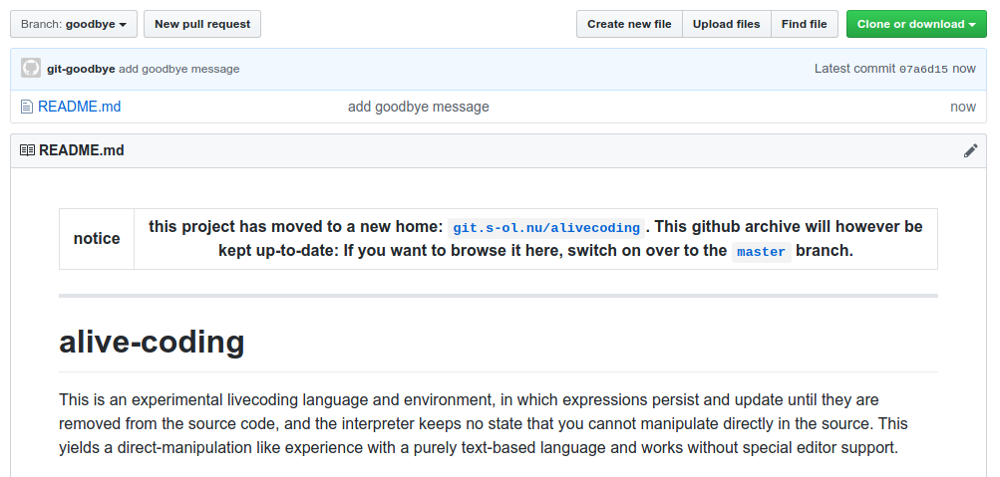

`git goodbye` is a post-update hook for saying goodbye to GitHub.

It can generate READMEs that link to the new location of projects formerly hosted on GitHub, and
then put that README on a new default branch so that people find the notice. With the hook the
repo can continue to be a read-only mirror and the README will track changes to upstream as well.

Here is what a repo with `git-goodbye` can look like: 

post-update hook
----------------

Simply install the post-update hook on your new remote according to your servers manual.
Make sure to adjust the message and links at the top of the hook according to your needs.

The hook will regenerate the `goodbye` branch whenever the `master` branch changes, and mirror
any changes to your remote using `git push --mirror`. After setting it up and doing a test push,
you can set the default branch of your GitHub repository to be `goodbye`, so that the notice is
displayed first.

manual usage
------------

If the hook doesn't suit your needs, there are also similar implementations for manual use from the
CLI that you can find in the `manual` directory. Choose whichever implementation you feel like
running and stick it in your `PATH` (or don't). Make sure to swap out the bit that matches your new
remote and links to it's public HTTP access.

Now you can visit your repos and say `$ git goodbye`.

`git goodbye` will create a README.md that points to your project's new location.
If you specify `--branch` it will create a branch called `goodbye` and commit the README there.
With `--all` it will also push the branch.
